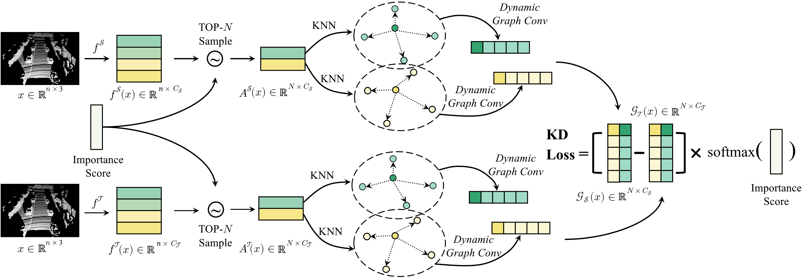

# PointDistiller
> [**PointDistiller: Structured Knowledge Distillation Towards Efficient and Compact 3D Detection**](https://openaccess.thecvf.com/content/CVPR2023/papers/Zhang_PointDistiller_Structured_Knowledge_Distillation_Towards_Efficient_and_Compact_3D_Detection_CVPR_2023_paper.pdf), CVPR'23 <br>
> [Linfeng Zhang](http://group.iiis.tsinghua.edu.cn/~maks/linfeng/index.html)\*, [Runpei Dong](https://runpeidong.com/)\*, [Hung-Shuo Tai](https://scholar.google.com/citations?user=_atJMtEAAAAJ&hl=en), and [Kaisheng Ma](http://group.iiis.tsinghua.edu.cn/~maks/leader.html) <br>

[arXiv](https://arxiv.org/abs/2205.11098) | [OpenAccess](https://openaccess.thecvf.com/content/CVPR2023/papers/Zhang_PointDistiller_Structured_Knowledge_Distillation_Towards_Efficient_and_Compact_3D_Detection_CVPR_2023_paper.pdf) | [Logs](https://drive.google.com/drive/folders/1jA14eMk-0fIywFxku-ijfMIBzFTp7Lef?usp=share_link)

This repository contains the implementation of the paper **PointDistiller: Structured Knowledge Distillation Towards Efficient and Compact 3D Detection** (CVPR 2023).



## Environment
This codebase was tested with the following environment configurations. It may work with other versions.
- Ubuntu 18.04/20.04
- CUDA 10.2/11.3
- GCC 7.5.0/9.4.0
- Python 3.7.11/3.8.8
- PyTorch 1.9.0/1.10.0
- [MMCV](https://mmcv.readthedocs.io/en/latest/) v1.4.8
- [MMDetection3D](https://github.com/open-mmlab/mmdetection3d) v1.0.0rc0+
- [MMDetection](https://github.com/open-mmlab/mmdetection) v2.22.0
- [MMSegmentation](https://github.com/open-mmlab/mmsegmentation) v0.22.1

## 1. Installation
Please refer to [getting_started.md](./getting_started.md) for installation.

## 2. Datasets
We use [KITTI](https://www.cvlibs.net/datasets/kitti/eval_object.php?obj_benchmark=3d) and [nuScenes](https://www.nuscenes.org/) datsets, please follow the [official instructions](https://mmdetection3d.readthedocs.io/en/latest/) for set up.

## 3. How to Run
Please make sure you have set up the environments and you can start knowledge distillation by running 
```bash
DEVICE_ID = <gpu_id>
CUDA_VISIBLE_DEVICES=$DEVICE_ID python tools/train.py <student_cfg> --use-kd # for single gpu
bash ./tools/dist_train.sh <student_cfg> 8 --use-kd # for multiple gpus
```
## License
PointDistiller is released under the MIT License. See the [LICENSE](./LICENSE) file for more details.

## Acknowledgements
Many thanks to following codes that help us a lot in building this codebase:
* [Object-Detection-Knowledge-Distillation-ICLR2021](https://github.com/ArchipLab-LinfengZhang/Object-Detection-Knowledge-Distillation-ICLR2021)
* [mmdetection](https://github.com/open-mmlab/mmdetection)
* [mmdetection3d](https://github.com/open-mmlab/mmdetection3d)
* [mmsegementation](https://github.com/open-mmlab/mmsegmentation)

## Citation

If you find our work useful in your research, please consider citing:
```latex
@inproceedings{pointdistiller23,
  title={PointDistiller: Structured Knowledge Distillation Towards Efficient and Compact 3D Detection},
  author={Linfeng Zhang and Runpei Dong and Hung-Shuo Tai and Kaisheng Ma},
  booktitle={IEEE/CVF Conference on Computer Vision and Pattern Recognition (CVPR)},
  year={2023},
}
```
